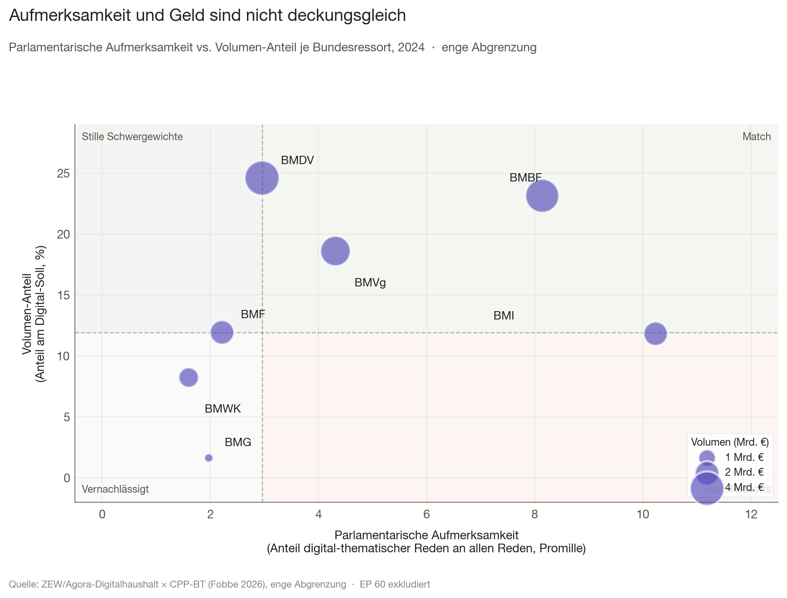
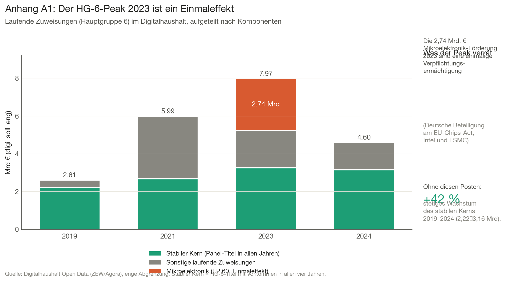

# Executive Summary

Mit der Gründung des Bundesministeriums für Digitales und Staatsmodernisierung (BMDS) im Jahr 2025 steht eine fundamentale Frage im Zentrum der politischen Debatte: Lässt sich der Digitalhaushalt des Bundes überhaupt zentral steuern? Die haushaltspolitische Realität zeigt hierbei oft eine deutliche Diskrepanz zwischen dem politischen Anspruch einer zentralen Steuerung und einer dezentralen, von reiner Förderlogik geprägten ministeriellen Praxis. Wir nutzen den erstmals öffentlich verfügbaren Datensatz des Zentrums für Europäische Wirtschaftsforschung (ZEW) und der Agora Digitale Transformation, um diese Frage empirisch zu vermessen.

Die Auswertung der Daten führt zu vier zentralen Befunden, deren Zusammenspiel das politische Gesamtbild ergibt:

Der Digitalhaushalt ist tiefgreifend polyzentrisch auf sechs Ressorts verteilt, jedes mit einem fundamental anderen Aufgaben-Profil. Auch das 2024 größte digital ausgebende Ressort (BMDV - Bundesministerium für Digitales und Verkehr) hält nur 23 Prozent des Gesamt-Solls. Unter den getroffenen Annahmen ergibt sich eine potenzielle direkte Steuerungsreichweite für ein zentrales BMDS von etwa 21 bis 23 Prozent des Volumens, der Rest ist ressortgebunden und nicht ohne Umressortierung der zugrundeliegenden Sachpolitik verlagerbar.

Zudem hat sich zwischen 2019 und 2024 die Logik der Mittelallokation drastisch verschoben. Die eigenen Investitionen des Bundes in Digitalisierung stagnieren absolut bei rund einer Milliarde Euro und schrumpfen anteilig von 10,9 auf 6,0 Prozent. Im selben Zeitraum verdoppeln Investitionszuschüsse an Länder und Private ihren Anteil von 15,9 auf 31,8 Prozent und wachsen absolut um 4,4 Milliarden Euro. Der Bund verteilt zunehmend, baut aber nicht selbst auf.

Schließlich reagiert die politische Sprache des Digitalhaushalts sichtbar auf Regierungswechsel. Viele Budgetaufwüchse beruhen auf reinem politischen Rebranding bei kaum verändertem inhaltlichen Kern. Die „Hightech-Strategie“ der Merkel-Ära verschwindet 2024 vollständig aus dem Haushalt und wird durch die „Zukunftsstrategie“ der Ampel-Regierung ersetzt. Dies ist ein methodisch ernüchternder Befund, da der ständige Austausch von Etiketten die transparente Debatte um die tatsächliche Wirksamkeit digitaler Programme massiv erschwert.

Zuletzt zeigt sich, dass die parlamentarische Aufmerksamkeit der Mittelverteilung nicht folgt. Verschnitten mit dem CPP-BT-Korpus der Bundestagsreden (Fobbe 2026) zeigt sich: Das BMDV als größtes digital ausgabendes Ressort (4,12 Mrd. €, Rang 1 im Volumen) erhält nur mediane parlamentarische Sichtbarkeit zu digitalen Themen (Rang 4 von 7, Diskrepanz +3). Das BMI dagegen generiert trotz mittleren Volumens (1,98 Mrd. €, Rang 5) die höchste parlamentarische Präsenz zu digitalen Themen (10,23 Promille, Rang 1, Diskrepanz −4). Der Bund redet nicht hauptsächlich über das, wofür er am meisten ausgibt.

Politische Implikation. Ein Digitalbudget muss zwei Bewegungen trennen, die im aktuellen Diskurs vermischt werden: zentrale Klassifikations- und Transparenzhoheit (das BMDS kann sie übernehmen) und operative Steuerungshoheit über die Mittel (sie ist aus den hier gezeigten strukturellen Gründen nur sehr begrenzt zentralisierbar). Wer beides verspricht, verspricht zu viel.

\newpage

# Leitfrage und Vorgehen {#sec-leitfrage}

Im Mai 2025 hat die schwarz-rote Koalition das Bundesministerium für
Digitales und Staatsmodernisierung (BMDS) eingerichtet, eine
institutionelle Antwort auf die seit Jahren wiederholte Klage, der Bund
brauche eine zentrale Steuerung für seine digitalen Aktivitäten. Gleichzeitig fordern Digitalverbände, der Bundesrechnungshof und das ZEW
die Etablierung eines „Digitalbudgets", das den Digitalhaushalt erstmals
einheitlich darstellt und steuerbar macht. Beide Vorhaben, BMDS-Steuerung und Digitalbudget beruhen auf einer
gemeinsamen, bislang kaum geprüften Annahme: dass der Digitalhaushalt des
Bundes überhaupt eine handhabbare Größe ist, die sich zentral fassen,
umverteilen oder strategisch steuern lässt. Diese Annahme prüfen wir
empirisch.

**Leitfrage.** Was kann das BMDS tatsächlich steuern, was nicht? Welche
strukturellen Grenzen ergeben sich aus der heutigen Verteilung und Logik
der digitalen Mittel?

**Vorgehen.** Wir nutzen den erstmals öffentlich verfügbaren Datensatz
des ZEW und der Agora Digitale Transformation, der für die Jahre 2019,
2021, 2023 und 2024 alle 21.358 Haushaltstitel mit ihren digitalen
Volumina ausweist. Wir gehen in vier Akten vor: Wo liegt das Geld (Akt 1),
was passiert damit (Akt 2), wie wird darüber gesprochen (Akt 3), und wer
redet wirklich worüber (Akt 4, Verschneidung mit CPP-BT-Plenarprotokollen). Aus diesen vier Befunden leiten wir eine politische Implikation für die
Debatte um Digitalbudget und BMDS-Mandat ab.

# Methodik im Überblick {#sec-methodik}

**Datenbasis.** Digitalhaushalt Open Data (ZEW/Agora, Stand 2025), 21.358
Beobachtungen über 6.240 unique Titel-IDs. Drei Geldspalten in Tausend
Euro: `soll` (Gesamt-Sollansatz), `digi_soll_eng` (eng abgegrenzter
Digital-Anteil) und `digi_soll_weit` (weit abgegrenzter Anteil
einschließlich Mischausgaben). Neun thematische Kategorie-Indikatoren
(Infrastruktur, Wirtschaft, Verwaltung, Kompetenzen, Kultur, Forschung,
Gesundheit, Bundeswehr, Unteilbares).

**Primäre Abgrenzung.** Alle Hauptbefunde dieses Essays beruhen auf der
engen Abgrenzung (`digi_soll_eng`). Die weite Abgrenzung dient als
Robustheitscheck, alle Befunde halten auch dort.

**Replikation.** Die folgende Tabelle zeigt die Replikation der
ZEW-Eckwerte. Unsere Aggregate weichen um weniger als 0,3 Prozent von
den publizierten Werten ab.



**Wichtige Limitationen** im Vorgriff: Wir analysieren Sollansätze, nicht
tatsächliche Auszahlungen; Verpflichtungsermächtigungen können
Soll-Sprünge erzeugen, die keine inhaltlichen Politikwechsel darstellen;
die Jahre 2020 und 2022 fehlen im Datensatz.

\newpage

# Akt 1  Wo liegt das Geld? {#sec-akt1}

**Kernbefund.** Sechs Ressorts decken 92 Prozent des Digital-Solls, mit
deutlich verschiedenen Aufgaben-Profilen. Selbst das größte Ressort hält
nur 23 Prozent. Eine BMDS-Bündelung ist auf maximal ein Viertel des
Volumens realistisch.

## Polyzentrische Struktur {#sec-polyzentrik}

Die naheliegende Erwartung, der Digitalhaushalt sei in einem oder zwei
„heimlichen Digitalministerien" konzentriert, hält der Datenprüfung nicht
stand. Der Bundeshaushalt ist in Einzelpläne (EP) gegliedert, je einen
pro Bundesministerium. Ihr Anteil am Digital-Soll wird über den
Herfindahl-Hirschman-Index (HHI, Skala 0–10.000; unter 1.500 fragmentiert,
1.500–2.500 mäßig konzentriert, über 2.500 stark konzentriert) gemessen. Zwischen 2019 und 2024 bewegt sich dieser Index im Bereich für moderat
fragmentierte Strukturen.



Konkret 2024: Sechs Bundesressorts decken 92 Prozent des Digital-Solls. Das größte Ressort (BMDV) hält 23 Prozent, keine dominante Position,
sondern eine knappe Spitze. BMBF (Bundesministerium für Bildung und
Forschung) liegt mit 22 Prozent praktisch gleichauf, gefolgt von
BMVg (Bundesministerium der Verteidigung, 17 Prozent),
BMF (Bundesministerium der Finanzen, 11 Prozent),
BMI (Bundesministerium des Innern und für Heimat, 11 Prozent) und
BMWK (Bundesministerium für Wirtschaft und Klimaschutz, 8 Prozent). Dabei wechselt die Spitzengruppe deutlich: In 2019 führte BMVg (EP 14)
mit 23 % vor BMBF, BMF und BMDV. 2024 fällt BMVg auf Rang 3; BMDV
steigt von Rang 4 auf Rang 1.

## Sechs Ressorts, sechs Profile {#sec-profile}

Entscheidender als die Verteilung der Volumina ist die Frage, wofür die
Ressorts ihr Digital-Geld verwenden. Wenn die Aufgaben ähnlich wären,
ließe sich über Bündelung sprechen. Sind sie es nicht, verlangt eine
Bündelung den Eingriff in die Sachpolitik des jeweiligen Hauses.

::: {.content-visible when-format="pdf"}
{#fig-h1}
:::

::: {.content-visible when-format="html"}
{#fig-h1}
:::

@fig-h1 zeigt, dass die Top-Ressorts qualitativ verschiedene
Digital-Profile haben. Die prozentualen Anteile pro Ressort:



- **BMDV** ist zu 84,5 Prozent ein Infrastruktur-Ressort: Breitbandausbau,
  ETCS-Schienenwege (European Train Control System), 5G-Förderung.
- **BMBF** verteilt sich praktisch gleichmäßig auf Forschungsförderung
  (47 Prozent) und digitale Kompetenzen (43 Prozent, im Wesentlichen der
  DigitalPakt für Schulen).
- **BMVg** ist zu 100 Prozent Bundeswehr-IT, eine eigene Welt, von der
  ZEW als solche markiert.
- **BMF** und **BMI** sind die einzigen klassischen Verwaltungs-Ressorts:
  ITZBund (IT-Dienstleistungszentrum Bund), Zoll, BSI (Bundesamt für
  Sicherheit in der Informationstechnik), Digitalfunk. Verwaltungs-IT
  macht 74,5 bzw. 81,7 Prozent ihres Digital-Solls aus.
- **BMWK** mischt Wirtschafts- und Forschungsförderung etwa hälftig.

Diese Profile sind nicht zufällig, sondern folgen der Logik der jeweiligen
Sachaufgaben. Der Verkehrsminister kann den Breitbandausbau nicht an ein
BMDS abgeben, ohne die Verantwortung für die digitale Infrastruktur
insgesamt aus der Hand zu geben.

## BMDS-Reichweite quantifiziert {#sec-szenarien}

Daraus folgt eine quantitative Aussage über die realistische
Steuerungsreichweite eines BMDS. Drei Szenarien für 2024:



Die ersten beiden Szenarien sind die realistischen. Unter den getroffenen Annahmen ergibt sich eine potenzielle direkte Steuerungsreichweite von etwa 21 bis 23 Prozent des haushalterischen Gesamtvolumens. Die übrigen knapp vier Fünftel bleiben sachlogisch eng an die Fachressorts und deren Autonomie gebunden.

\newpage

# Akt 2 - Was passiert mit dem Geld? {#sec-akt2}

**Kernbefund.** Eigene Bundes-Investitionen stagnieren, Investitions-
zuschüsse an Länder und Private verdoppeln ihren Anteil. Der Bund
verteilt zunehmend, baut aber selbst nicht zunehmend auf.

## Die Erwartung und ihr Widerspruch {#sec-erwartung}

Eine wiederkehrende Sorge in der Digitalpolitik lautet: Der Bund
finanziert immer mehr den Betrieb bestehender IT-Systeme statt
Transformation. Die Hauptgruppen-Logik der Bundeshaushaltsordnung
unterscheidet zwischen konsumtiven Ausgaben (Hauptgruppen 4–6: Personal,
sächlicher Verwaltungsaufwand, laufende Zuweisungen) und investiven
Ausgaben (Hauptgruppen 7–8: Baumaßnahmen, sonstige
Investitionsausgaben). Die Daten widersprechen der Erwartung zunächst: Der Investitionsanteil
am Digital-Soll springt 2024 von 26 auf 38 Prozent. Auf den ersten
Blick eine Investitionsoffensive. Dieser Sprung verschwindet bei
genauerer Betrachtung als eigenständiges Phänomen, er ist Symptom einer
anderen, stärkeren Verschiebung.

## Eigene Investition vs. Transfer {#sec-schere}

::: {.content-visible when-format="pdf"}
{#fig-h2}
:::

::: {.content-visible when-format="html"}
{#fig-h2}
:::

@fig-h2 zerlegt die investiven Ausgaben in zwei Untergruppen: Was der
Bund selbst beschafft oder baut (Obergruppen 81 und 82 der
Haushaltssystematik) und was er als Investitions-Zuschuss an Dritte
weitergibt (Obergruppen 83, 86, 87, 88 und 89: Länder,
Sozialversicherungen, Private im Inland).



Die Ergebnisse sind eindeutig: Eigene Investitionen des Bundes wachsen
von 0,93 auf 1,08 Mrd. € (+17 Prozent), schrumpfen aber anteilig von
10,9 auf 6,0 Prozent. Investitions-Zuschüsse an Dritte wachsen von 1,35
auf 5,71 Mrd. € (+322 Prozent) und verdoppeln ihren Anteil von 15,9 auf
31,8 Prozent. Das ist keine Investitionsoffensive des Bundes. Es ist eine
Investitionsoffensive durch den Bund für andere Akteure.

## Die Treiber {#sec-treiber}

Wer treibt diese Verschiebung?



Zwei Einzelpläne erklären gemeinsam knapp drei Viertel des Anstiegs. **EP 12 (BMDV):** Die Breitbandausbau-Förderung an Länder, Kommunen und
private Telekommunikationsunternehmen erreicht 2024 ein Volumen von
1,77 Mrd. €; die Förderung der ETCS-Schienenwege liegt bei 1,08 Mrd. €.
Beides sind Investitions-Zuschüsse an Dritte, nicht eigene Bundes-Bauten. **EP 30 (BMBF):** Die Zuweisungen an Länder für die digitale Bildung
(DigitalPakt-Folge) erreichen 2024 ein Volumen von 1,25 Mrd. €.

## Politische Lesart {#sec-politische-lesart}

Die Verschiebung ist Ausdruck einer strukturellen Eigenschaft deutscher
Digitalpolitik: Der Bund hat in den föderalen und privatrechtlich
organisierten Bereichen, in denen Digitalisierung physisch und operativ
stattfindet, Schulen, Telekommunikationsinfrastruktur,
Sozialversicherungen, Verkehrsnetze, keine eigenen Bau- und
Betriebszuständigkeiten. Er fördert.

Das hat zwei Implikationen für die BMDS-Diskussion. Erstens: Selbst wenn
ein BMDS Steuerungshoheit über mehr als die 21 bis 23 Prozent aus Akt 1
erhielte, würde es überwiegend Förderprogramme verwalten, nicht selbst
Digitalisierungsprojekte durchführen. Zweitens: Die Wirksamkeit dieser
Förderung hängt von der Umsetzungsfähigkeit der Empfänger (Länder,
Kommunen, Unternehmen) ab, nicht primär von der Steuerungslogik des
fördernden Bundesressorts.

\newpage

# Akt 3 - Wie wird über das Geld gesprochen? {#sec-akt3}

**Kernbefund.** Politisches Rebranding statt Buzzword-Inflation. Die
Haushaltssprache reagiert auf Regierungswechsel.

## Buzzword-Inflation nicht nachweisbar {#sec-buzzwords}

Bei der ersten Sichtung der Daten erwarteten wir, die Häufigkeit moderner
Digital-Schlagwörter (KI, Cloud, Souveränität, Cybersicherheit) würde im
Haushalt stärker steigen als das ihnen unterlegte Volumen. Die
Datenprüfung widerspricht dieser Erwartung.

Begriffe wie „Künstliche Intelligenz" und „Quantentechnologie" wachsen
zwar mit Faktor 5 bis 30 in der Häufigkeit, allerdings von einer extrem
kleinen Basis (KI: 1 → 36 Treffer in Titelbezeichnungen). Generische
Begriffe wie „Software" oder „Informationstechnik" wachsen volumetrisch
(Faktor 1,4 bzw. 2,3), aber kaum in der Treffer-Häufigkeit, bestehende
Posten werden teurer, nicht häufiger benannt. Eine Inflation des
Sprachgebrauchs ohne entsprechende Volumendeckung ist im Datensatz nicht
nachweisbar.

## Rebranding bei Regierungswechsel {#sec-rebranding}

Stattdessen tritt ein anderes Phänomen deutlich hervor: politisches
Rebranding bei stabilem inhaltlichem Kern.

::: {.content-visible when-format="pdf"}
{#fig-h4}
:::

::: {.content-visible when-format="html"}
{#fig-h4}
:::



@fig-h4 zeigt die deutlichste Episode: Die „Hightech-Strategie", das
Strategie-Label der Merkel-Jahre für staatliche Forschungs- und
Innovationsförderung, ist 2019 mit 40 Haushalts­titeln und 1,32 Mrd. €
belegt. 2024 ist das Label vollständig aus dem Bundeshaushalt
verschwunden, null Treffer, null Euro. An seiner Stelle erscheint die
„Zukunftsstrategie", das Strategie-Label der Ampel-Regierung. 2019 null
Treffer. 2024: 46 Haushaltstitel mit zusammen 1,89 Mrd. €. Die Größenordnung ist vergleichbar (Volumen-Faktor 1,43), das politische
Etikett ist neu, der Inhalt bleibt stabil.

Daraus ergibt sich ein relevanter politischer Befund, der weit über eine bloße Beobachtung zur Begriffswahl hinausgeht: Dieses strategische Rebranding verschleiert strukturelle Kontinuitäten in der ministerialen Praxis. Es suggeriert politisch einen Aufbruch und den Beginn neuer Digitalisierungsphasen, wo in der Verwaltung oft lediglich bestehende Förderlinien unter neuem Namen fortgeschrieben werden. Das bindet nicht nur erhebliche administrative Ressourcen für die Umetikettierung, sondern verhindert vor allem die Möglichkeit einer transparenten, über mehrere Legislaturperioden hinweg vergleichbaren Erfolgsmessung echten digitalen Fortschritts. Ein zentrales BMDS stünde vor dem Problem, dass sich hinter neu benannten Titeln oft verfestigte Programme verbergen, die wenig echten, frei lenkbaren Innovationsspielraum erlauben.

## EP 60 als Schatten-Förderkanal {#sec-ep60}

Eine nicht trivial benannte Stelle im Haushalt verdient Erwähnung:
Einzelplan 60, die „Allgemeine Finanzverwaltung". Dieser Einzelplan wird
in den Jahren seit 2021 systematisch für digitale Industriepolitik im
großen Stil genutzt: 2023 Förderung von Projekten im Bereich
Mikroelektronik mit einem Sollansatz von 2,74 Mrd. € (EU-Chips-Act-
Initiative, konkret Intel-Magdeburg und ESMC-Dresden); 2021 je rund
0,4 Mrd. € für Künstliche Intelligenz und Quantentechnologie. Diese Mittel sind klassifikatorisch Teil des Digitalhaushalts, inhaltlich
aber überwiegend Industriepolitik in digital geprägten Branchen. Eine
zentrale Steuerung durch ein BMDS würde an dieser Stelle die
Industriepolitik-Hoheit der Fachressorts berühren.

::: {.callout-note title="Methoden-Box: Verpflichtungsermächtigungen verzerren Soll-Trends"}
Sieben der acht größten Soll-Rückgänge von 2023 auf 2024 in der
Hauptgruppe 6 (laufende Zuweisungen) enthalten im Titeltext das Wort
„Verpflichtungsermächtigung". Eine VE ist eine mehrjährige Förderzusage,
die im Bewilligungsjahr als hoher Sollansatz erscheint, in Folgejahren
aber als Null. Der Politikinhalt läuft im Hintergrund weiter; nur die
Soll-Reihe sieht aus, als sei das Programm gestoppt worden. Wer
Soll-Zeitreihen interpretiert, muss diesen Mechanismus mitdenken.
:::

\newpage

# Akt 4 - Wer redet worüber? {#sec-akt4}

**Kernbefund.** Die parlamentarische Aufmerksamkeit folgt der Mittelverteilung
nicht. Das ausgabenstärkste Ressort erzeugt nur mediane Debattenpräsenz;
das Innenministerium dominiert die digitale Bundestagsdebatte bei mittlerem
Volumen. Aufmerksamkeit und Geld sind im Digitalhaushalt orthogonal verteilt.

## Hypothese: Aufmerksamkeits-Volumen-Diskrepanz {#sec-h5-hypothese}

Akte 1 bis 3 zeigen, wo das Geld liegt, wie es eingesetzt wird und wie
es benannt wird. Es bleibt eine vierte Frage: Worüber debattiert der
Bundestag tatsächlich und deckt sich das mit dem, was finanziert wird? Diese Frage prüfen wir mit einer Verschneidung der ZEW-Haushaltsdaten
mit dem CPP-BT-Korpus der Bundestagsreden, die hinter dem
Digitalbudget-Diskurs eine bislang ungeprüfte Annahme sichtbar macht:
Die politische Debatte konzentriere sich auf das, was finanziert wird.

Für jedes Ressort zählen wir, in wie vielen Plenarprotokollen 2019, 2021,
2023 und 2024 ressortspezifische Begriffe und Digital-Schlagwörter
gleichzeitig auftreten. Das Verhältnis zur Gesamtzahl aller Reden des
jeweiligen Jahres, ausgedrückt in Promille (Anteil je 1.000 Reden),
ergibt den parlamentarischen Aufmerksamkeits-Anteil. Dieser wird dem
Anteil des Ressorts am Digital-Soll gegenübergestellt.

## Methodik und Datenquelle {#sec-h5-methodik}

**Verschneidungs-Korpus:** CPP-BT (Corpus Plenarprotokolle Bundestag,
Fobbe 2026), Version 2026-01-17, Public Domain (CC0). Enthält 78.188
Einzelreden ab der 18. Wahlperiode; im Analysezeitraum 2019–2024 sind
30.458 Reden enthalten.

**Begriffs-Mapping:** Das Vokabular ist in `src/reden_mapping.py` hinterlegt. `DIGITAL_BEGRIFFE` umfasst 30+ digitale Schlagwörter, die aus den ZEW-Tags
abgeleitet sind. `RESSORT_BEGRIFFE` ordnet jedem Ressort 5–10 ressortspezifische
Begriffe zu. Eine Rede zählt als Digital-Aufmerksamkeit für ein Ressort, wenn
sie beide Begriffsgruppen gleichzeitig enthält.

**Hinweis zu Prozentangaben:** Die Volumen-Anteile in Akt 4 beziehen sich
auf den Anteil der sieben analysierten Hauptressorts am gesamten
Digitalhaushalt (Nenner ca. 16,8 Mrd. €, ohne kleinere Einzelpläne). Das weicht leicht von den 23 Prozent in Akt 1 ab, die alle 24 aktiven
Einzelpläne (Nenner 17,94 Mrd. €) einschließen.

**Limitation:** Der Drucksachen-Korpus CDRS-BT, ursprünglich als zweite
Verschneidungsebene geplant, ist nur bis 2017 verfügbar und damit für unsere
Analyse-Jahre unbrauchbar. Die vorliegenden Befunde beruhen allein auf
Plenarreden und sind als Exploration zu verstehen, nicht als abschließende
Diagnose.

## Befund: Quadranten-Analyse 2024 {#sec-h5-befund}

::: {.content-visible when-format="pdf"}
{#fig-h5 width=90%}
:::

::: {.content-visible when-format="html"}
{#fig-h5 width=90%}
:::

@fig-h5 zeigt die vier Quadranten des Aufmerksamkeits-Volumen-Raums, definiert
durch die Mediane beider Dimensionen. Das markanteste stille Schwergewicht 2024 ist das BMDV: Es hält mit
4,12 Mrd. € das größte Digital-Soll aller Ressorts (Volumen-Rang 1, 24,5 %
Anteil), liegt bei der parlamentarischen Aufmerksamkeit zu digitalen Themen
aber nur auf Rang 4 (2,96 Promille, exakt der Median). Diskrepanz-Indikator:
+3. Die Breitband- und ETCS-Transfer-Investitionen, die den BMDV-Etat dominieren,
erzeugen im parlamentarischen Digitalraum deutlich weniger Debattenraum als ihr
Volumen erwarten ließe.

Das ausgeprägteste Buzz-Ressort 2024 ist das BMI: Rang 5 im Volumen
(1,98 Mrd. €, 11,8 % Anteil), aber Rang 1 in der Aufmerksamkeit (10,23 Promille). Diskrepanz-Indikator: −4. Cybersicherheit, BSI, Digitalfunk und digitale
Verwaltungsthemen ziehen parlamentarische Debatten weit über ihren Mittelanteil
hinaus.

BMBF und BMVg zeigen 2024 ausgeglichene Match-Profile (Diskrepanz 0):
ihre parlamentarische Sichtbarkeit entspricht ihrem Anteil am Digitalhaushalt.

## Politische Lesart {#sec-h5-lesart}

Die Diskrepanz zwischen Aufmerksamkeits-Polyzentrik und Mittel-Polyzentrik
hat eine direkte Implikation für die BMDS-Diskussion: Wer sich am Debate-Lärm
orientiert, unterschätzt systematisch die Gewichte des BMDV. Umgekehrt ist das
BMI im öffentlichen Digitalraum präsenter, als sein Anteil an der Mittelverteilung
nahelegt. Ein BMDS, das Klassifikations- und Transparenzhoheit übernehmen will, muss
daher beide Achsen abdecken, die der Mittel (Akt 1) und die der Aufmerksamkeit
(Akt 4). Nur so lässt sich der Digitalbudget-Diskurs mit der tatsächlichen
Haushaltswirklichkeit verbinden.

\newpage

# Zusammenführung: Was kann das BMDS steuern? {#sec-synthese}

Die drei Befunde ergeben zusammen eine strukturelle Diagnose deutscher
Digital-Haushaltspolitik.

**Akt 1** zeigt, dass das Geld auf sechs Ressorts mit fundamental
verschiedenen Aufgaben verteilt ist. Eine zentrale Steuerung ist auf
ein Fünftel des Volumens begrenzt. **Akt 2** zeigt, dass selbst innerhalb
dieser Verteilung der Bund seine Rolle vom Selbst-Aufbau zur Verteilung
verschiebt. Wer zentral steuern wollte, würde überwiegend Förderprogramme
verwalten, nicht Aufbauarbeit leisten. **Akt 3** zeigt, dass die politische
Sprache des Digitalhaushalts auf Regierungen reagiert, der inhaltliche Kern
aber stabil bleibt und dass über klassifikatorische Grauzonen wie EP 60
Industriepolitik in den Digitalhaushalt eingeht, die mit einer
BMDS-Querschnittssteuerung schwer vereinbar ist. **Akt 4** fügt eine dritte
Achse hinzu: Die parlamentarische Aufmerksamkeit ist von der Mittelverteilung
entkoppelt. Das BMDV als Spitzenreiter im Volumen bleibt debattenmäßig im
Median; das BMI beherrscht den Digitalraum des Bundestages weit über seinen
Mittelanteil hinaus. Die Polyzentrik der Mittel und die Polyzentrik des
Diskurses sind nicht dieselbe Polyzentrik.

**Politische Implikation.** Ein Digitalbudget muss zwei Bewegungen
unterscheiden, die in der aktuellen Debatte vermischt werden:

1. **Klassifikations- und Transparenzhoheit.** Welche Haushaltstitel
   gelten als „digital"? Wer definiert eng und weit? Wer berichtet
   einheitlich? Diese Hoheit kann das BMDS sinnvoll und ohne große
   Verfassungs- oder Sachkonflikte übernehmen. Sie ist der direkte Hebel
   für mehr Steuerbarkeit und demokratische Kontrolle.

2. **Operative Steuerungshoheit über die Mittel.** Welches Ressort
   entscheidet, wie viel für welche digitale Aufgabe ausgegeben wird? Diese Hoheit lässt sich aus den hier gezeigten strukturellen Gründen
   nur sehr begrenzt zentralisieren, etwa für die Verwaltungs-IT der
   zivilen Ressorts. Für Forschung, Bildung, Verkehrsinfrastruktur,
   Wehr-IT und Industriepolitik bleibt sie aus guten Gründen bei den
   Fachressorts.

Wer beides als BMDS-Mandat verspricht, verspricht zu viel. Wer aber das
erste konsequent einlöst und das zweite ehrlich begrenzt, kann die
strukturelle Lücke schließen, die ein „Digitalbudget" als demokratischer
Kontrollmechanismus tatsächlich hat.

# Anhang: HG-6-Drilldown {#sec-anhang}

Der Peak der Hauptgruppe 6 (laufende Zuweisungen) im Jahr 2023 zerlegt
sich in einen Mikroelektronik-Einmaleffekt und einen stetig wachsenden
„stabilen Kern" (+42 Prozent).

::: {.content-visible when-format="pdf"}
{#fig-anhang-a1}
:::

::: {.content-visible when-format="html"}
{#fig-anhang-a1}
:::

# Limitationen und offene Fragen {#sec-limitationen}

- **Soll, nicht Ist.** Wir analysieren Haushaltssollansätze, nicht
  tatsächliche Auszahlungen.
- **Verpflichtungsermächtigungen.** Siehe die Methoden-Box in Akt 3
  (Abschnitt „EP 60 als Schatten-Förderkanal").
- **Klassifikation als Setzung.** Die ZEW-Klassifikation
  Mikroelektronik = digital ist eine politische Entscheidung, über die
  diskutiert werden kann.
- **Jahres-Lücken.** 2020 und 2022 fehlen, Corona- und Energiekrise-
  Effekte bleiben außen vor.
- **Externe Validierung.** Die drei Top-Transfer-Posten (Breitband,
  ETCS, DigitalPakt-Folge) sind datenseitig identifiziert; eine
  qualitative Validierung über IT-Großprojekte-Bericht und
  Bundesrechnungshof-Bemerkungen wurde nicht durchgeführt. Die
  Befunde beruhen auf dem ZEW-Datensatz allein.
- **Akt 4: Reden-Mapping approximativ.** Das Schlagwort-Mapping in
  `src/reden_mapping.py` ist eine Näherung. Reden besprechen Themen,
  nicht Haushaltspositionen. Der Drucksachen-Korpus CDRS-BT als zweite
  Verschneidungsebene ist nur bis 2017 verfügbar und konnte nicht
  einbezogen werden.

# Daten, Code, Reproduzierbarkeit {#sec-repro}

Sämtliche Analysen und Charts sind im öffentlichen Repository
reproduzierbar. Die zentrale Lade-Funktion (`src/load.py`) repliziert die
ZEW-Eckwerte auf 0,3 Prozent genau. Fünf Analyse-Notebooks
(`notebooks/00_profiling.ipynb` bis `notebooks/04_reden_aufmerksamkeit.ipynb`)
und fünf Chart-Notebooks decken alle Hauptbefunde dieses Essays ab. Für
Notebook 04 ist zusätzlich der CPP-BT-Korpus (ca. 118 MB ZIP) unter
`data/external/` erforderlich.

Zum Erzeugen dieses Dokuments (Quarto ≥ 1.4, LaTeX/TinyTeX), aus dem
Repo-Root:

```bash
quarto render outputs/ergebnis.qmd --to pdf
```

Repository-URL: https://github.com/kalknord/agora_challenge

Lizenzen: Code unter MIT, Inhalte unter CC BY 4.0.

# Quellen {#sec-quellen}

**Primärdaten.**

- ZEW Mannheim / Agora Digitale Transformation (2025): Digitalhaushalt
  Open Data. https://agoradigital.de/projekte/digitalhaushalt
- Fobbe, Sean (2026): Corpus der Plenarprotokolle des Deutschen Bundestages
  (CPP-BT), Version 2026-01-17. Zenodo. https://doi.org/10.5281/zenodo.4542661
  (Public Domain, CC0)

**Studien und Policy Papers.**

- ZEW Mannheim / Agora Digitale Transformation (2025): Studie zum
  Digitalhaushalt 2025. https://agoradigital.de/projekte/digitalhaushalt
- Agora Digitale Transformation (2025): Policy Paper „Vom Digitalhaushalt
  zum Digitalbudget". https://agoradigital.de/projekte/digitalhaushalt
- Agora Digitale Transformation (2025): Analyse Haushalt 2026 (BMDS).
  https://agoradigital.de/projekte/digitalhaushalt
- Agora Digitale Transformation: Policy Paper „Der erhoffte Schub?"
  https://agoradigital.de/projekte/digitalhaushalt

**Externe Validierungs-Quellen (nicht einbezogen, siehe Limitationen).**

- IT-Großprojekte-Bericht des Bundes (jährlich, BMI)
- Bundesrechnungshof, Bemerkungen zu IT-Vorhaben
- Bundeshaushaltspläne 2019, 2021, 2023, 2024
