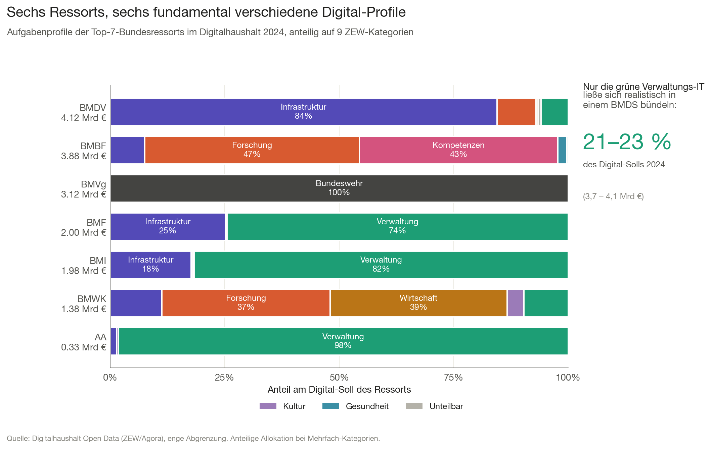
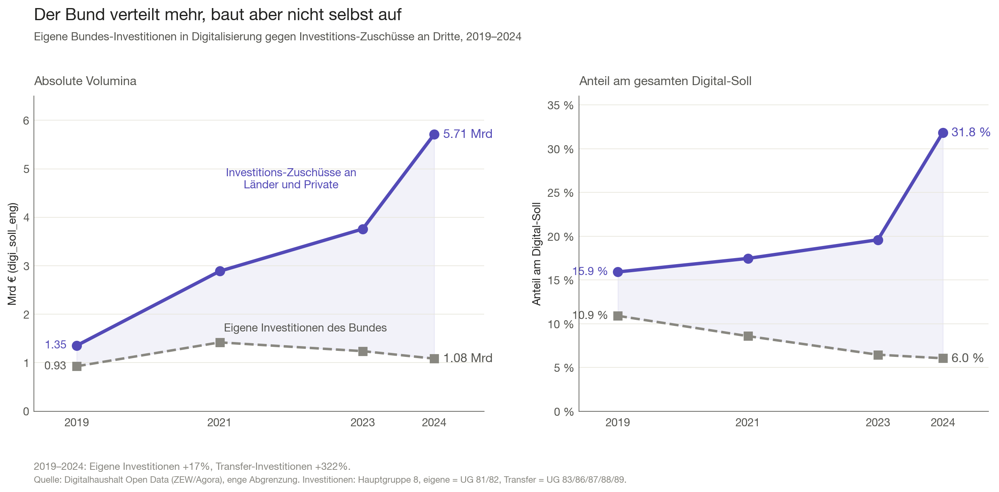
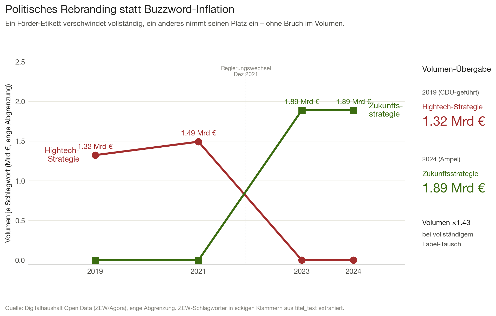

# Executive Summary

[TODO Schreib-Person: einmal komplett gegenlesen. Stand: Phase 2 abgeschlossen, externe Validierung der drei großen Transfer-Posten steht noch aus.]

Mit der Gründung des Bundesministeriums für Digitales und
Staatsmodernisierung (BMDS) im Jahr 2025 ist die alte Frage zurück auf der
politischen Agenda: Lässt sich der Digitalhaushalt des Bundes zentral
steuern? Wir nutzen den erstmals öffentlich verfügbaren Datensatz des
Zentrums für Europäische Wirtschaftsforschung (ZEW) und der Agora
Digitale Transformation, um diese Frage empirisch zu vermessen.

Drei Befunde, deren Zusammenspiel das politische Gesamtbild ergibt.

**Erstens.** Der Digitalhaushalt ist polyzentrisch auf sechs Ressorts
verteilt, jedes mit einem fundamental anderen Aufgaben-Profil. Auch das
2024 größte digital ausgebende Ressort (BMDV) hält nur 23 Prozent des
Gesamt-Solls. Eine zentrale Steuerung durch das BMDS ist auf 21 bis 23
Prozent des Volumens realistisch begrenzt — der Rest ist ressortgebunden
und nicht ohne Umressortierung der zugrundeliegenden Sachpolitik
verlagerbar.

**Zweitens.** Zwischen 2019 und 2024 hat sich die Logik der Mittel
verschoben. Die eigenen Investitionen des Bundes in Digitalisierung
stagnieren absolut bei rund einer Milliarde Euro und schrumpfen anteilig
von 10,9 auf 6,0 Prozent. Im selben Zeitraum verdoppeln Investitions-
zuschüsse an Länder und Private ihren Anteil von 15,9 auf 31,8 Prozent
und wachsen absolut um 4,4 Milliarden Euro. Der Bund verteilt zunehmend,
baut aber nicht selbst auf.

**Drittens.** Die politische Sprache des Digitalhaushalts reagiert
sichtbar auf Regierungswechsel. Die „Hightech-Strategie" der Merkel-Ära
verschwindet 2024 vollständig aus dem Haushalt (1,32 Mrd. €  → 0). An
ihrer Stelle erscheint die „Zukunftsstrategie" der Ampel-Regierung (0
→ 1,89 Mrd. €). Politisches Rebranding bei kaum verändertem Inhalt — ein
methodisch ernüchternder Befund für jede Debatte um Inhalt und
Wirksamkeit digitaler Programme.

**Politische Implikation.** Ein Digitalbudget muss zwei Bewegungen
trennen, die im aktuellen Diskurs vermischt werden: zentrale
Klassifikations- und Transparenzhoheit (das BMDS kann sie übernehmen) und
operative Steuerungshoheit über die Mittel (sie ist aus den hier gezeigten
strukturellen Gründen nur sehr begrenzt zentralisierbar). Wer beides
verspricht, verspricht zu viel.

\newpage

# 1. Leitfrage und Vorgehen

[TODO Schreib-Person: Anschluss an die laufende politische Debatte
aktualisieren, sobald die ZEW-Studie und die zwei Agora-Policy-Papers
durchgelesen sind. Lese-Tabelle in `docs/bereits_gesagt_vs_luecke.md`
fortlaufend pflegen.]

Im Mai 2025 hat die schwarz-rote Koalition das Bundesministerium für
Digitales und Staatsmodernisierung (BMDS) eingerichtet — eine
institutionelle Antwort auf die seit Jahren wiederholte Klage, der Bund
brauche eine zentrale Steuerung für seine digitalen Aktivitäten.
Gleichzeitig fordern Digitalverbände, der Bundesrechnungshof und zuletzt
auch das ZEW [TODO: konkretes Zitat aus ZEW-Studie nachtragen] die
Etablierung eines „Digitalbudgets", das den Digitalhaushalt erstmals
einheitlich darstellt und steuerbar macht.

Beide Vorhaben — BMDS-Steuerung und Digitalbudget — beruhen auf einer
gemeinsamen, bislang kaum geprüften Annahme: dass der Digitalhaushalt des
Bundes überhaupt eine handhabbare Größe ist, die sich zentral fassen,
umverteilen oder strategisch steuern lässt. Diese Annahme prüfen wir
empirisch.

**Leitfrage.** Was kann das BMDS tatsächlich steuern, was nicht? Welche
strukturellen Grenzen ergeben sich aus der heutigen Verteilung und Logik
der digitalen Mittel?

**Vorgehen.** Wir nutzen den erstmals öffentlich verfügbaren Datensatz
des ZEW und der Agora Digitale Transformation, der für die Jahre 2019,
2021, 2023 und 2024 alle 21.358 Haushaltstitel mit ihren digitalen
Volumina ausweist. Wir gehen in drei Akten vor: Wo liegt das Geld
(Akt 1), was passiert damit (Akt 2) und wie wird darüber gesprochen
(Akt 3). Aus diesen drei Befunden leiten wir eine politische Implikation
für die Debatte um Digitalbudget und BMDS-Mandat ab.

# 2. Methodik im Überblick

[Verweis auf `METHODOLOGY.md` für Details. Hier nur eine halbseitige
Einordnung für Leser:innen.]

**Datenbasis.** Digitalhaushalt Open Data (ZEW/Agora, Stand 2025), 21.358
Beobachtungen über 6.240 unique Titel-IDs. Drei Geldspalten in Tausend
Euro: `soll` (Gesamt-Sollansatz), `digi_soll_eng` (eng abgegrenzter
Digital-Anteil) und `digi_soll_weit` (weit abgegrenzter Anteil
einschließlich Mischausgaben). Neun thematische Kategorie-Indikatoren
(Infrastruktur, Wirtschaft, Verwaltung, Kompetenzen, Kultur, Forschung,
Gesundheit, Bundeswehr, Unteilbares).

**Primäre Abgrenzung.** Alle Hauptbefunde dieses Essays beruhen auf der
engen Abgrenzung (`digi_soll_eng`). Die weite Abgrenzung dient als
Robustheitscheck — alle Befunde halten auch dort.

**Replikation.** Unsere Aggregate der enge Abgrenzung weichen um
weniger als 0,3 Prozent von den in der ZEW-Studie publizierten
Eckwerten ab (Mrd. €): 2019 = 8,51 vs. 8,5; 2021 = 16,55 vs. 16,6;
2023 = 19,19 vs. 19,2; 2024 = 17,94 vs. 17,9.

**Wichtige Limitationen** im Vorgriff: Wir analysieren Sollansätze, nicht
Ist-Auszahlungen; Verpflichtungsermächtigungen können Soll-Sprünge
erzeugen, die keine inhaltlichen Politikwechsel darstellen; die Jahre
2020 und 2022 fehlen im Datensatz. Details in der Methodik-Datei.

\newpage

# 3. Akt 1 — Wo liegt das Geld?

**Kernbefund.** Sechs Ressorts decken 92 Prozent des Digital-Solls, mit
deutlich verschiedenen Aufgaben-Profilen. Selbst das größte Ressort hält
nur 23 Prozent. Eine BMDS-Bündelung ist auf maximal ein Viertel des
Volumens realistisch.

## 3.1 Polyzentrische Struktur

Die naheliegende Erwartung, der Digitalhaushalt sei in einem oder zwei
„heimlichen Digitalministerien" konzentriert, hält der Datenprüfung
nicht stand. Zwischen 2019 und 2024 schwankt der Herfindahl-Hirschman-
Index der Einzelplan-Anteile zwischen 1.247 (2023) und 1.701 (2019).
Diese Werte liegen im international etablierten Bereich für **moderat
fragmentierte** Strukturen — zum Vergleich: der Bundestag nach den
Sitzanteilen 2021 läge ungefähr bei 1.900, ein konzentrierter Markt erst
über 2.500.

Konkret 2024: Sechs Bundesressorts decken 92 Prozent des Digital-Solls.
Das größte Ressort (BMDV, Verkehr und digitale Infrastruktur) hält 23
Prozent — keine dominante Position, sondern eine knappe Spitze. BMBF
liegt mit 22 Prozent praktisch gleichauf, gefolgt von BMVg (17 Prozent),
BMF (11 Prozent), BMI (11 Prozent) und BMWK (8 Prozent).

[TODO Schreib-Person: Rangwechsel zwischen 2019 und 2024 als Absatz
ausformulieren. Auffälligkeiten: BMVg fällt von Rang 1 auf Rang 3, BMDV
steigt von Rang 4 auf Rang 1.]

## 3.2 Sechs Ressorts, sechs Profile

Entscheidender als die Verteilung der Volumina ist die Frage, wofür die
Ressorts ihr Digital-Geld jeweils verwenden. Wenn die Aufgaben ähnlich
wären, ließe sich politisch über Bündelung sprechen. Sind sie es nicht,
verlangt eine Bündelung den Eingriff in die Sachpolitik des jeweiligen
Hauses.

{#fig-h1}

@fig-h1 zeigt, dass die Top-Ressorts qualitativ verschiedene Digital-
Profile haben:

- **BMDV** ist zu 85 Prozent ein Infrastruktur-Ressort: Breitbandausbau,
  ETCS-Schienenwege, 5G-Förderung.
- **BMBF** verteilt sich praktisch gleichmäßig auf Forschungsförderung
  (47 Prozent) und digitale Kompetenzen (43 Prozent, im Wesentlichen der
  DigitalPakt für Schulen).
- **BMVg** ist zu 100 Prozent Bundeswehr-IT — eine eigene Welt, von der
  ZEW als solche markiert.
- **BMF** und **BMI** sind die einzigen klassischen Verwaltungs-
  Ressorts: ITZBund, Zoll, BSI, Digitalfunk. Verwaltungs-IT macht 75
  bzw. 82 Prozent ihres Digital-Solls aus.
- **BMWK** mischt Wirtschafts- und Forschungsförderung etwa hälftig.

Diese Profile sind nicht zufällig, sondern folgen der Logik der
jeweiligen Sachaufgaben. Der Verkehrsminister kann den Breitbandausbau
nicht an ein BMDS abgeben, ohne die Verantwortung für die digitale
Infrastruktur insgesamt aus der Hand zu geben.

## 3.3 BMDS-Reichweite quantifiziert

Daraus folgt eine quantitative Aussage über die realistische
Steuerungsreichweite eines BMDS. Wir rechnen drei Szenarien für 2024:

- **Minimal:** Verwaltungs-IT aller zivilen Ressorts (ohne BMDV) wird
  ins BMDS verlagert. Volumen: 3,70 Mrd. € = **20,6 Prozent** des
  Digital-Solls.
- **Realistisch:** Zusätzlich die Infrastruktur-IT des BMI (BSI,
  Digitalfunk, Cyber-Abwehr). Volumen: 4,05 Mrd. € = **22,6 Prozent**.
- **Maximal:** Alle Ressorts außer Verteidigung und Forschung werden
  bündelungsfähig betrachtet. Volumen: 11,77 Mrd. € = **65,6 Prozent**.
  Dieses Szenario verlangt, dass BMDV die Verkehrsinfrastruktur, BMBF
  die digitale Bildung und BMWK die Wirtschaftsförderung jeweils an das
  BMDS abgeben — politisch unrealistisch.

Die ersten beiden Szenarien sind die realistischen. Das **BMDS hat im
besten Fall Steuerungshoheit über etwa ein Fünftel des Digitalhaushalts.
Die übrigen vier Fünftel bleiben bei den Fachressorts.**

# 4. Akt 2 — Was passiert mit dem Geld?

**Kernbefund.** Eigene Bundes-Investitionen stagnieren, Investitions-
zuschüsse an Länder und Private verdoppeln ihren Anteil. Der Bund
verteilt zunehmend, baut aber selbst nicht zunehmend auf.

## 4.1 Die Erwartung und ihr Widerspruch

Eine wiederkehrende Sorge in der Digitalpolitik lautet: Der Bund
finanziert immer mehr den Betrieb bestehender IT-Systeme statt
Transformation. Die Hauptgruppen-Logik der Bundeshaushaltsordnung
unterscheidet zwischen konsumtiven Ausgaben (Hauptgruppen 4–6: Personal,
sächlicher Verwaltungsaufwand, laufende Zuweisungen) und investiven
Ausgaben (Hauptgruppen 7–8: Baumaßnahmen, sonstige
Investitionsausgaben).

Die Daten widersprechen der Erwartung zunächst: Der Investitionsanteil
am Digital-Soll **springt** 2024 von 26 auf 38 Prozent. Auf den ersten
Blick eine Investitionsoffensive.

Dieser Sprung verschwindet bei genauerer Betrachtung als eigenständiges
Phänomen — er ist Symptom einer anderen, stärkeren Verschiebung.

## 4.2 Eigene Investition vs. Transfer

{#fig-h2}

@fig-h2 zerlegt die investiven Ausgaben in zwei Untergruppen: Was der
Bund **selbst** beschafft oder baut (Obergruppen 81 und 82 der
Haushaltssystematik) und was er als **Investitions-Zuschuss an Dritte**
weitergibt (Obergruppen 83, 86, 87, 88 und 89: Länder, Sozial-
versicherungen, Private im Inland).

Die Ergebnisse sind eindeutig:

- **Eigene Investitionen** des Bundes in Digitalisierung wachsen
  zwischen 2019 und 2024 von 0,93 auf 1,08 Mrd. € (+17 Prozent). Anteilig
  am Digital-Soll **sinken** sie von 10,9 auf 6,0 Prozent.
- **Investitions-Zuschüsse an Dritte** wachsen im selben Zeitraum von
  1,35 auf 5,71 Mrd. € (+322 Prozent). Anteilig **verdoppeln** sie sich
  von 15,9 auf 31,8 Prozent.

Das ist keine Investitionsoffensive des Bundes. Es ist eine
Investitionsoffensive **durch** den Bund **für** andere Akteure.

## 4.3 Die Treiber

Wer treibt diese Verschiebung? Zwei Einzelpläne erklären gemeinsam knapp
drei Viertel des Anstiegs.

- **EP 12 (BMDV):** Die Breitbandausbau-Förderung an Länder, Kommunen
  und private Telekommunikationsunternehmen erreicht 2024 ein Volumen von
  1,77 Mrd. €. Die Förderung der ETCS-Schienenwege liegt bei 1,08 Mrd. €.
  Beides sind Investitions-Zuschüsse an Dritte, nicht eigene Bundes-
  Bauten. [TODO: Externe Validierung über IT-Großprojekte-Bericht und
  Bundesrechnungshof-Bemerkungen.]
- **EP 30 (BMBF):** Die Zuweisungen an Länder für die digitale Bildung
  (DigitalPakt-Folge) erreichen 2024 ein Volumen von 1,25 Mrd. €.
  Strukturell ein Transfer an die Länder, der dort über die
  Schulträger weiter verteilt wird. [TODO: Externe Validierung über
  KMK-Berichte.]

## 4.4 Politische Lesart

Die Verschiebung ist mehr als eine haushaltstechnische Kuriosität. Sie
ist Ausdruck einer strukturellen Eigenschaft deutscher Digitalpolitik:
Der Bund hat in den föderalen und privatrechtlich organisierten Bereichen,
in denen Digitalisierung physisch und operativ stattfindet — Schulen,
Telekommunikationsinfrastruktur, Sozialversicherungen, Verkehrsnetze —
**keine eigenen Bau- und Betriebszuständigkeiten**. Er fördert.

Das hat zwei Implikationen für die BMDS-Diskussion. Erstens: Selbst wenn
ein BMDS Steuerungshoheit über mehr als die 21 bis 23 Prozent aus
Akt 1 erhielte, würde es überwiegend Förderprogramme verwalten —
nicht selbst Digitalisierungsprojekte durchführen. Zweitens: Die
Wirksamkeit dieser Förderung hängt von der Umsetzungsfähigkeit der
Empfänger (Länder, Kommunen, Unternehmen) ab, nicht primär von der
Steuerungslogik des fördernden Bundesressorts.

\newpage

# 5. Akt 3 — Wie wird über das Geld gesprochen?

**Kernbefund.** Politisches Rebranding statt Buzzword-Inflation. Die
Haushaltssprache reagiert auf Regierungswechsel.

## 5.1 Eine ursprünglich gestellte, dann verworfene Hypothese

Bei der ersten Sichtung der Daten erwarteten wir, die Häufigkeit
moderner Digital-Schlagwörter (KI, Cloud, Souveränität, Cybersicherheit)
würde im Haushalt stärker steigen als das ihnen unterlegte Volumen — ein
typisches Inflations-Muster. Die Datenprüfung widerspricht dieser
Erwartung.

Begriffe wie „Künstliche Intelligenz" und „Quantentechnologie" wachsen
zwar mit Faktor 5 bis 30 in der Häufigkeit, allerdings von einer extrem
kleinen Basis (KI: 1 → 36 Treffer in `titel_text`). Generische Begriffe
wie „Software" oder „Informationstechnik" wachsen volumetrisch (Faktor
1,4 bzw. 2,3), aber kaum in der Treffer-Häufigkeit — bestehende Posten
werden teurer, nicht häufiger benannt. Eine Inflation des Sprachgebrauchs
ohne entsprechende Volumendeckung ist im Datensatz nicht nachweisbar.

## 5.2 Rebranding bei Regierungswechsel

Stattdessen tritt ein anderes Phänomen deutlich hervor: politisches
Rebranding bei stabilem inhaltlichem Kern. Die deutlichste Episode
betrifft zwei Strategie-Etiketten, die exakt komplementär verlaufen.

{#fig-h4}

@fig-h4 zeigt die „Hightech-Strategie", das Strategie-Label der Merkel-
Jahre für staatliche Forschungs- und Innovationsförderung. 2019 sind
dem Begriff 40 Haushaltstitel mit zusammen 1,32 Mrd. € zugeordnet. 2024
ist das Label vollständig aus dem Bundeshaushalt verschwunden — null
Treffer, null Euro.

An seiner Stelle erscheint die „Zukunftsstrategie", das
Strategie-Label der Ampel-Regierung für dasselbe Politikfeld. 2019 null
Treffer. 2024: 46 Haushaltstitel mit zusammen 1,89 Mrd. €.

Die Größenordnung ist vergleichbar (Volumen-Faktor 1,43), das politische
Etikett ist neu, der Inhalt wird in den nächsten Iterationen der Studie
noch genauer geprüft. [TODO: Stichproben-Vergleich einzelner Titel
2019/2024 hinsichtlich Bezeichnung und Gegenstand. Wie viele der 2019er
Hightech-Titel finden sich 2024 wortgleich oder semantisch identisch unter
Zukunftsstrategie wieder?]

## 5.3 EP 60 als Schatten-Förderkanal

Eine zweite, nicht trivial benannte Stelle im Haushalt verdient
Erwähnung: Einzelplan 60, die „Allgemeine Finanzverwaltung". Dieser
Einzelplan bündelt traditionell Ausgaben, die nicht eindeutig einem
Fachressort zuzuordnen sind. In den Jahren seit 2021 wird er
systematisch für **digitale Industriepolitik im großen Stil** genutzt.

- **2023:** Förderung von Projekten im Bereich Mikroelektronik mit
  einem Sollansatz von 2,74 Mrd. €. Hintergrund: deutsche Beteiligung an
  der EU-Chips-Act-Initiative, konkret an Intel-Magdeburg und
  ESMC-Dresden. [TODO: Validierung über Bundestags-Drucksachen zum
  Chips-Act.]
- **2021:** Je rund 0,4 Mrd. € für die Bereiche Künstliche Intelligenz
  und Quantentechnologie.
- **2024:** Praktisch null — das Volumen ist nicht „gestoppt", sondern
  als mehrjährige Verpflichtungsermächtigung im Bewilligungsjahr
  ausgewiesen worden (siehe Methoden-Box unten).

Diese Mittel sind klassifikatorisch Teil des Digitalhaushalts, inhaltlich
aber überwiegend Industriepolitik in digital geprägten Branchen. Eine
zentrale Steuerung durch ein BMDS würde an dieser Stelle die
Industriepolitik-Hoheit der Fachressorts (BMWK, BMBF) berühren.

::: {.callout-note title="Methoden-Box: Verpflichtungsermächtigungen verzerren Soll-Trends"}
Sieben der acht größten Soll-Rückgänge von 2023 auf 2024 in der
Hauptgruppe 6 (laufende Zuweisungen) enthalten im Titeltext das Wort
„Verpflichtungsermächtigung". Eine VE ist eine mehrjährige Förderzusage,
die im Bewilligungsjahr als hoher Sollansatz erscheint, in Folgejahren
aber als Null. Der Politikinhalt läuft im Hintergrund weiter; nur die
Soll-Reihe sieht aus, als sei das Programm gestoppt worden. Wer Soll-
Zeitreihen interpretiert, muss diesen Mechanismus mitdenken.
:::

\newpage

# 6. Zusammenführung: Was kann das BMDS steuern?

Die drei Befunde stehen nicht beziehungslos nebeneinander. Sie ergeben
zusammen eine strukturelle Diagnose deutscher Digital-Haushaltspolitik.

**Akt 1** zeigt, dass das Geld auf sechs Ressorts mit fundamental
verschiedenen Aufgaben verteilt ist — eine zentrale Steuerung ist auf
ein Fünftel des Volumens begrenzt. **Akt 2** zeigt, dass selbst innerhalb
dieser Verteilung der Bund seine Rolle vom Selbst-Aufbau zur
Verteilung verschiebt. Wer zentral steuern wollte, würde überwiegend
Förderprogramme verwalten, nicht Aufbauarbeit leisten. **Akt 3** zeigt
schließlich, dass die politische Sprache des Digitalhaushalts auf
Regierungen reagiert, der inhaltliche Kern aber stabil bleibt — und
dass über klassifikatorische Grauzonen wie EP 60 Industriepolitik in
den Digitalhaushalt eingeht, die mit einer BMDS-Querschnittssteuerung
schwer vereinbar ist.

**Politische Implikation.** Ein Digitalbudget muss zwei Bewegungen
unterscheiden, die in der aktuellen Debatte vermischt werden:

1. **Klassifikations- und Transparenzhoheit.** Welche Haushaltstitel
   gelten als „digital"? Wer definiert eng und weit? Wer berichtet
   einheitlich? Diese Hoheit kann das BMDS sinnvoll und ohne große
   Verfassungs- oder Sachkonflikte übernehmen. Sie ist der direkte
   Hebel für mehr Steuerbarkeit und demokratische Kontrolle.
2. **Operative Steuerungshoheit über die Mittel.** Welches Ressort
   entscheidet, wie viel für welche digitale Aufgabe ausgegeben wird?
   Diese Hoheit lässt sich aus den hier gezeigten strukturellen Gründen
   nur sehr begrenzt zentralisieren — etwa für die Verwaltungs-IT der
   zivilen Ressorts. Für Forschung, Bildung, Verkehrsinfrastruktur,
   Wehr-IT und Industriepolitik bleibt sie aus guten Gründen bei den
   Fachressorts.

Wer beides als BMDS-Mandat verspricht, verspricht zu viel. Wer aber das
erste konsequent einlöst und das zweite ehrlich begrenzt, kann die
strukturelle Lücke schließen, die ein „Digitalbudget" als demokratischer
Kontrollmechanismus tatsächlich hat.

# 7. Limitationen und offene Fragen

[TODO Schreib-Person: ausformulieren, ggf. mit Schwerpunkten.]

- **Soll, nicht Ist.** Wir analysieren Haushaltssollansätze, nicht
  tatsächliche Auszahlungen.
- **Verpflichtungsermächtigungen.** Siehe Methoden-Box in Abschnitt 5.3.
- **Klassifikation als Setzung.** Die ZEW-Klassifikation Mikroelektronik
  = digital ist eine politische Entscheidung, über die diskutiert werden
  kann.
- **Jahres-Lücken.** 2020 und 2022 fehlen — Corona-/Energiekrise-
  Effekte bleiben außen vor.
- **Externe Validierung.** Drei der Top-Transfer-Posten (Breitband,
  ETCS, DigitalPakt-Folge) sind bislang nur datenseitig identifiziert.
  Eine qualitative Validierung über IT-Großprojekte-Bericht und
  Bundesrechnungshof-Bemerkungen steht aus und wird im Repo nachgepflegt.

# 8. Daten, Code, Reproduzierbarkeit

Sämtliche Analysen und Charts sind im öffentlichen Repository
reproduzierbar. Die zentrale Lade-Funktion (`src/load.py`) repliziert die
ZEW-Eckwerte auf 0,3 Prozent genau. Vier Analyse-Skripte
(`notebooks/00_profiling.py` bis `notebooks/03_h4_rebranding.py`) und
drei Chart-Skripte (`notebooks/chart_h1.py`, `chart_h2.py`,
`chart_h4.py`) decken alle Hauptbefunde dieses Essays ab.

Repository-URL: [TODO: GitHub-Link einfügen, sobald veröffentlicht]

Lizenzen: Code unter MIT, Inhalte unter CC BY 4.0.

# Quellen

[TODO Schreib-Person: vollständige Bibliographie nach abgeschlossener
Lektüre und externer Validierung.]

**Primärdaten.**

- ZEW Mannheim / Agora Digitale Transformation (2025): Digitalhaushalt
  Open Data. https://agoradigital.de/projekte/digitalhaushalt

**Studien und Policy Papers (zu lesen, dann hier zitieren).**

- ZEW/Agora-Studie zum Digitalhaushalt 2025
- Agora Digitale Transformation: Policy Paper „Vom Digitalhaushalt zum
  Digitalbudget"
- Agora Digitale Transformation: Studie zum Digitalhaushalt 2025
- Agora Digitale Transformation: Analyse Haushalt 2026 (BMDS)
- Agora Digitale Transformation: Policy Paper „Der erhoffte Schub?"

**Externe Validierungs-Quellen (geplant).**

- IT-Großprojekte-Bericht des Bundes (jährlich, BMI)
- Bundesrechnungshof, Bemerkungen zu IT-Vorhaben
- Bundeshaushaltspläne 2019, 2021, 2023, 2024
